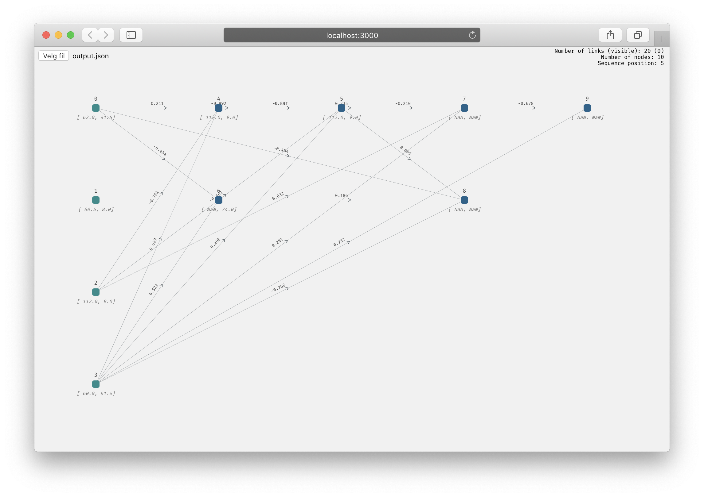

# Network Visualizer
Powerful network/graph visualizer written in Node.js.




## Supports
- High performance for huge networks (>1'000 nodes and >10'000 edges)
- Changes over time (sequenced data)
- Arbitrary number of Node-attributes
- Interactive design elements

## How To
1.  Install packages and run Node.js
    ```node
    npm install
    npm start
    ```
2. In Node app, open you exported .json file (see [how to do format](##JSON-Format) below)
3. Use left- and right arrows to navigate forward/backward in sequence.


## Sequence Manager
Manager written in Rust to help format the .json input file in the correct way. Se [SequenceManager](https://github.com/volanpar/sequence_manager) for more details.

## JSON Format
```json
{
    "meta": {
        "filters": {
            "link": {}
        },
        "properties": {
            "column-spacing": 200,
            "nodes-per-layer": 50,
            "row-spacing": 150
        }
    },
    "sequence": [
        {
            "nodes": [nodes-json-list],
            "links": [edge-json-list]
        },
        {
            "nodes": [nodes-json-list2],
            "links": [edge-json-list2]
        },
        .
        .
        .
    ]
}

```

## Node JSON List
### Attributes
- #### Reserved
    - **id**: [Mandatory] Node identifier (only integer)
    - **sub_id**: [Optional] String, int, float.
    - **__layer**: [Optional] Which layer do the node occur (interger)
    - **__type**: [Optional] Three types: 'input', 'hidden', 'external' (string)
    - **__activated**: [Optional] `true` or `false` (bool)

- #### Optional
    - Every attribute other than the reserved ones mentioned above, will get displayed when node is hovered.


### Example
```json
"nodes": [
    {
        "id": 0,
        "last": "2.0",
        "sub_id": "[0.45, 0.98]",
        "__layer": 0,
        "__type": "input",
    },
    {
        "id": 1,
        "last": "2.0",
        "sub_id": "[0.43, 0.12]",
        "__layer": 0,
        "__type": "input",
    },
    {
        "id": 2,
        "last": "3.0",
        "sub_id": "[0.99, 0.11]",
        "__layer": 1,
        "__type": "hidden",
    }
]
```

## Edge JSON List
### Attributes
- #### Reserved
    - **source** [Mandatory] Pre-node in edge
    - **target** [Mandatory] Post-node in edge
    - **strength** [Mandatory] Weight of the edge
    - **__show** [Optional] This field is shown above the edge

```json
"links": [
    {
        "source": 0,
        "target": 4,
        "strength": 0.21061644142731106,
        "__show": 0.211
    },
    {
        "source": 2,
        "target": 4,
        "strength": -0.7617778321727182,
        "__show": -0.762
    },
    {
        "source": 3,
        "target": 4,
        "strength": 0.629103416725787,
        "__show": 0.629
    }
],
```
